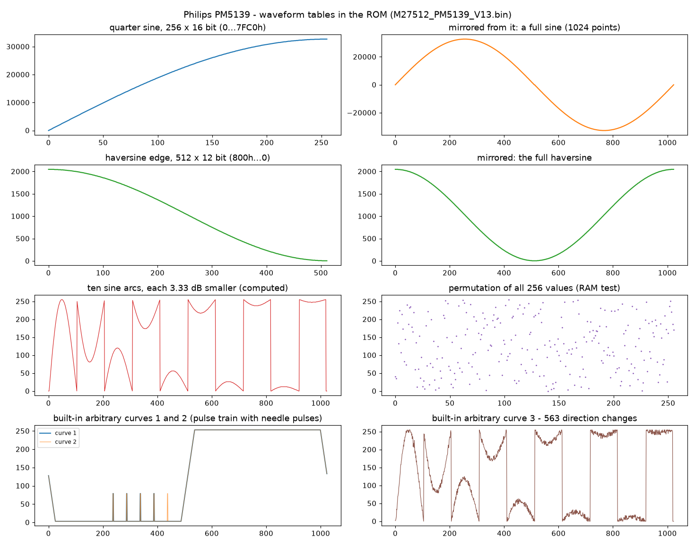
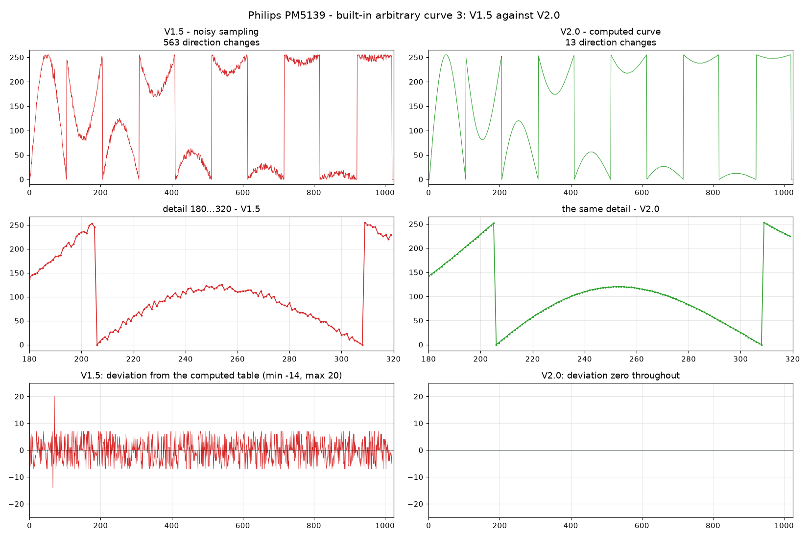
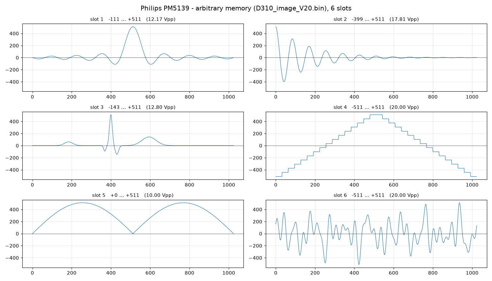

# Philips PM5139 — Firmware Reverse Engineering

A 20 MHz function generator from about 1994, taken apart in software: two
EPROM dumps, an 8051 emulator used as a measuring instrument, and 35
sections of documentation where every single claim is backed by a listing
address, an emulator measurement, or the schematic.

At the end of it there is a **firmware V2.0** that fixes a defect Philips
shipped, six arbitrary waveforms of our own, and a browser simulator that
runs the original ROM instruction by instruction.



*Every waveform table in the program EPROM, plotted straight out of the
binary. Bottom right is the one that started the most interesting part of
this project.*

---

## Contents

- [What this is](#what-this-is)
- [Results at a glance](#results-at-a-glance)
- [The instrument](#the-instrument)
- [The method: the emulator is the measuring instrument](#the-method-the-emulator-is-the-measuring-instrument)
- [The road here](#the-road-here)
- [The good bits](#the-good-bits)
- [Firmware V2.0 — what is new](#firmware-v20--what-is-new)
- [The easter egg](#the-easter-egg)
- [And then it turned out to be polyphonic](#and-then-it-turned-out-to-be-polyphonic)
- [Six arbitrary waveforms of our own](#six-arbitrary-waveforms-of-our-own)
- [The browser simulator](#the-browser-simulator)
- [Repository layout](#repository-layout)
- [Using the tools](#using-the-tools)
- [Reproducing everything](#reproducing-everything)
- [Flashing it back](#flashing-it-back)
- [How reliable is this?](#how-reliable-is-this)
- [Still open](#still-open)
- [Sources](#sources)

---

## What this is

The Philips PM5139 is the 20 MHz top model of a three-instrument family
(PM5136 / PM5138A / PM5139). Inside sits a PCB80C652 — an 8051 core with
hardware I²C — a 27512 program EPROM, and six analogue assemblies hanging
off a serial bus.

There is **no PM5139 service manual**. People have been looking for one in
forums since 2010. What exists is the manual for the PM5138A, its 10 MHz
sister model, which is internally almost identical.

So this project started from the other end: dump the EPROM, and work out
what the code does until the instrument is understood well enough to
modify it.

Two firmware versions were available, **V1.3 and V1.5**, both 64 KiB
M27512 dumps.

---

## Results at a glance

| | |
|---|---|
| **Disassembly** | complete for both versions, ~23 000 lines, with cross-references |
| **Annotated listing** | 147 named routines, 145 header comments, 3 826 annotated lines |
| **Documentation** | 35 sections, 4 600 lines, every claim sourced |
| **Signal path** | frequency, amplitude, offset, AM, FM, burst, symmetry, sweep — all computed and verified against the original code |
| **Hardware** | all 10 strobes, the C-bus, I²C with every participant, ports, keyboard, rotary knob, display bitmap |
| **State bits** | 75 of 128 with a documented effect |
| **Version diff** | V1.3 vs V1.5 is 91.4 % structurally identical; every change named |
| **Emulators** | one in Python, one in JavaScript (~8 M instructions/s), plus a single-file browser simulator |
| **Our own firmware** | V2.0 — a factory defect fixed, checksum handled, verified in the emulator and on real hardware |

---

## The instrument

| Position | Type | Function |
|---|---|---|
| D301 | PCB80C652 | 8051 core with hardware I²C, 12 MHz |
| D306 | 27512 | program EPROM — V1.3 occupies `0000h–AC70h` |
| D310 | X28C64 | arbitrary EEPROM on the MOVX bus |
| D305 | PCF8570 | 256 bytes of battery-backed NVRAM on I²C (`A0h`) |
| D304-A | PCF8576 | LCD driver on I²C (`70h`), 20-byte buffer |
| D302-A | SAA3007 | keyboard encoder, pulse-width coded on a single line |
| D307 | 74HCT4514 | strobe decoder — the strobe number is address bits A8…A11 |

The analogue side is a **serial C-bus**: the 8051's UART runs in shift
register mode, TXD is the clock, RXD the data, and a strobe decides which
of the ten shift registers latches the bytes. `MOV DPH,#8nh` followed by
`MOVX @DPTR,A` fires strobe *n*. That one line is the key to the whole
analogue section.

---

## The method: the emulator is the measuring instrument

This is the part worth stealing for your own project.

Reading a 44 KB 8051 binary by eye gets you maybe a third of the way.
Everything past that came from **running the original code and watching
what falls out**:

```python
# What formula turns the entered amplitude into the byte on the bus?
# Don't read the routine. Call it.
c = CPU(rom)
for w in test_values:
    set_amplitude(c, w)
    c.call(0x0AAC)          # the original routine, untouched
    print(w, c.ram[0x1C])   # the byte that goes out on STR9
```

Vary the input, read the output, check it against the hypothesis. That
worked for frequency, amplitude, offset, AM depth, FM deviation, burst
count, symmetry and both sweep characteristics. Each formula in the
documentation comes with the sample points it was verified over.

Three refinements made it actually productive:

**Watch the bus, not the display.** Section 15 measures what a state bit
does to the display buffer, and 74 of 128 bits appear to do nothing. But
many of them don't drive the display, they drive the *analogue
assemblies* — and those are only visible as telegrams on the C-bus.
Recording `MOV SBUF,…` and the terminating `MOVX @DPTR` lifted the count
of documented bits from 54 to 75.

**Press keys, don't poke RAM.** Setting a RAM byte by hand produces
states the instrument never takes. That cost us two wrong findings and
one crash into the command table. Injecting real key codes through the
emulated SAA3007 gives states the firmware actually reaches — and it was
a brute-force sweep over all 256 key codes that revealed which key
triggers which handler.

**Suspect your own emulator first.** Three bugs in our core produced
"inexplicable" firmware behaviour: `ACALL` executed as `AJMP`, a missing
auxiliary-carry flag (so `DA A` misbehaved and the firmware appeared to
count in binary), and a doubled keyboard interrupt. Every finding from
that period was re-measured afterwards.

---

## The road here

**Static first.** A disassembler with a full opcode table, then recursive
descent with jump-table heuristics. That produced 30 508 bytes of code
and left 13 637 bytes unaccounted for.

**Then dynamic.** A trace run — cold start, all 23 front panel keys, both
directions of the knob, every operating mode, 86 million cycles — marking
every address that actually executed. Held against the static analysis,
it found exactly **one** area the descent had missed, and 10 686 of the
unexplained bytes turned out to be five known table blocks.

**Then the schematics.** The service manual's OCR is useless for
schematics, but the page images at 400 dpi are excellent. Cut into
overlapping tiles, they are readable down to pin numbers. Six sheets
were read off this way — and where five parallel traces run 90 pixels
apart, eyeballing was replaced by a script (`lines.py`) that extracts
the line segments from the bitmap.

**Then the two chips that were pulled.** A 27C64 labelled "SINUS 1.1"
and an X28C64 were read out. Both were placed in the schematic and their
contents decoded.

**Then the version diff.** Tokenising both ROMs (relative jump distances
instead of absolute targets) and running `SequenceMatcher` over them
gives an address mapping that survives code motion — that's how the V1.3
symbols get carried onto V1.5.

---

## The good bits

### Philips shipped a noisy waveform

The three built-in arbitrary curves live at `A047h`, `A447h` and `A847h`.
The third one has the same shape as a table that already sits in the ROM
in computed form — but with **563 direction changes against 13**, and a
standard deviation of 4.1 LSB.

It was sampled from an analogue source instead of being computed. The
mean of the deviation is zero, only two of 1024 points are off by more
than 10 — this is not a different waveform, it is the *same* waveform
with noise on it.

### That table is a 30 dB level ladder

The clean version was described in an earlier draft as "a sine with ten
AM depths", which was an eyeball reading of the plot, not something the
code says. Computed through, the 1024 points split into ten sine arcs
whose spans are

```
255  171  120  80  56  38  26  17  12  8
```

a geometric series with ratio **0.681 = 10^(−1/6)**, i.e. **3.33 dB per
step and 30.1 dB overall**. A halving model is off by up to 56, a 3 dB
model by 10. It's a logarithmic level ladder — an amplitude or
attenuation test pattern.

### STR9 sends 16 bits as two 1-byte telegrams

The amplitude controller has two shift registers on one strobe, but the
firmware only ever sends one byte per telegram. The schematic explains
it: the two 4094s are cascaded through **QS' (pin 10)**, with pin 9
unused — and the telegrams come in pairs, ~42 000 cycles apart with
millions of cycles of silence between pairs. The byte sent *first* gets
pushed through into the second register.

The same cascade pattern turned up on every assembly with more than one
shift register — including one case where the chain crosses an assembly
boundary through a line called `E`.

### The attenuator isn't a calculation

Five bits in the STR9 telegram drive relays directly: `S1` switches the
DC generator range, `S2…S5` the attenuator relays. `20 dB (for 40dB)`,
`20 dB`, `50/600 ohms` — it's printed on the schematic. There are no
thresholds to compute.

### A handler hiding in plain sight

The jump table at `0301h` is read with `JMP @A+DPTR`. Entry 15 lands at
`0301h + 30 = 031Fh` — and there, instead of the usual `AJMP`, sits **the
handler itself**, inline, saving a jump. No jump instruction anywhere in
the ROM points at it, so the static analysis lost it. It's the DIAL LOCK
handler, and only the dynamic trace found it.

### Six arbitrary slots, not twenty-four

The data sheet promises 24 waveform memories. The directory in the EEPROM
says six. The arithmetic settles it:

```
1024 points × 10 bit, packed 4 values per 5 bytes  ->  1280 bytes per curve
 6 × 1280 =  7 680 bytes, 0100h…1EFFh   (X28C64,  8 KB)  <- what was fitted
24 × 1280 = 30 720 bytes, 0100h…78FFh   (X28C256, 32 KB) <- what the schematic says
```

The measured read range of the firmware is `0100h–1EFFh` — six curves to
the byte. The instrument was built with the small chip.

### Dead code talking to a device that isn't there

186 bytes at `9AFFh` do I²C traffic with address `5Ah` — an address that
appears nowhere else. In **both** firmware versions, no jump points at
it. It sits in the same device-type block as the interface card at `5Eh`,
just with different bank bits, and it sends the receive buffer and the
arithmetic registers out in two ten-byte telegrams. It looks like a
factory diagnostic for a device that never shipped.

### You cannot execute code from the arbitrary EEPROM

An obvious idea — put code in an arbitrary waveform slot and jump to it —
is dead on arrival. The 8051 is Harvard: instructions come through
`/PSEN` from the program EPROM, data through `/RD` from the arbitrary
EEPROM. It isn't blocked; the wire simply isn't there.

### And the frequency encoding, finally

The display digit row lives in `3Eh–43h` of the image sent to the
PCF8576, all positions share one segment encoding, and byte `43h`
switches from kHz to MHz between decade 7 and 8. From that:

```
f = M · 10^(D−8) kHz
```

Three frequency stepping sequences measured on the real instrument are
reproduced exactly by this — including the one that stops early because
the mantissa 2500 would mean 25 MHz, over the limit.

---

## Firmware V2.0 — what is new



*Left the shipped curve, right the corrected one. Bottom left is the
deviation from the computed table — that band of ±5 LSB is what a
sampled analogue source left behind.*

`mkv20.py` builds V2.0 from V1.5 (or V1.3). It finds every address by
signature rather than hardcoding them, so the same script works on both
source versions:

1. **Arbitrary curve 3 replaced** with the clean computed table. Both are
   1024 bytes of 8 bit, so the swap is size-neutral and touches no code.
   863 of 1024 bytes change.
2. **Arbitrary curve 2 replaced** with a logarithmic chirp (1 → 40
   periods). It differed from curve 1 in exactly *two* bytes — one extra
   needle pulse — so it was redundant.
3. **Version identification** in `*IDN?`: `PHILIPS,PM5139,0,V2.0/0000`.
4. **Version on the display**: the reset sequence writes two display
   cells, and those bytes now spell `2.0` in the measured segment
   encoding.
5. **Checksum recomputed** and stored where the firmware expects it.

Everything else is untouched. Three further oddities were found and
deliberately left alone — a write to a non-existent SFR (harmless, in
both versions), the dead `5Ah` block, and three state bits that are
tested but never set. Patching them changes no behaviour and only adds
risk.

`M27512_PM5139_V20.bin` is exactly this and nothing else. The melody
below is a separate, opt-in build step.

**Verified:** cold start in the emulator produces the same display buffer
and the same flags as V1.5, the checksum validates, and the build is
byte-reproducible. It has been flashed and runs on a real PM5139 — the
display shows `2.0` and all six arbitrary slots work.

---

## The easter egg

Since there are **19 509 unused bytes** behind the checksum in V1.5, and
the frequency path takes a note frequency as three BCD bytes, the
instrument can play music through its own output.

The encoding is pleasantly direct — decade 3, then the frequency in
0.01 Hz as BCD, so 82.41 Hz is `30 82 41`. Four bytes per note: three for
the pitch, one for the duration.

The interesting part is the trigger. The diagnostic menu (hold LOCAL
while switching on) has a jump table with **eight** entries, but the menu
loop counts `0Bh` only from 1 to 7 — so the eighth entry is unreachable.
It is also redundant: it jumps to the menu start, which is reached from
two other places anyway.

So the whole hook is **two bytes**:

```
5B94h   table entry 8: LJMP 5B45h  ->  LJMP <melody>
5B62h   count limit:   08h         ->  09h
```

No self-test is lost, no table is relocated, and no dead menu item
appears. Hold LOCAL, switch on, let the menu count to 8, press a key.

The timing comes from the MCS-51 data sheet. Both emulators now count
machine cycles alongside instructions (`mcyc`, from `mcs51.CYCLES`), and
stepping the wait loop measures **1009 µs** per unit — 106.95 ms per
sixteenth note at 140 BPM, 0.2 % off target. The figure used to be a hand
calculation of 1006 µs that had dropped two instructions.

`mkdoom.py` can also convert a MIDI file. A voice has to be picked
(highest note, lowest note, or one channel) and sections shorter than
~25 ms merged — below that a low note doesn't manage a full oscillation
and you only hear a click.

---

## And then it turned out to be polyphonic

The melody above is one voice. It does not have to be, and the reason is
a sentence in the service manual we had read past:

> During signal generation, the distinct signal amplitude samples are read
> out from the RAM. If the basic signal waveform is altered [...] the
> corresponding amplitude samples are **loaded into the RAM by the CPU**.

The PM5139 is a **1024-point wavetable DDS**. The TWS is not a triangle
generator in any naive sense — it is a phase accumulator that produces
read addresses 0…1023 for a fast RAM on unit 4, and that RAM is filled by
the CPU over the C-bus. Sine, square, sawtooth and arbitrary are all the
same mechanism: a table.

And the table holds exactly **one period of the output**. So a table built
from a *sum of harmonics* is still periodic in its 1024 points, and it
plays as a chord. Not an arpeggio, not a modulation trick — several notes
sounding at once at the full 20 Vpp, with the CPU doing nothing at all
while they sound. Because the partials must be integer multiples of the
table frequency, the intervals come out in just intonation, which for a
sustained chord is the better tuning anyway.

`M27512_PM5139_V20_chords.bin` is in the repository ready to burn — the
riff, in chords, with the envelope. To build it yourself, or to use a
MIDI file of your own instead of the built-in riff:

```
python3 mkpoly.py --chord crunch M27512_PM5139_V20.bin out.bin
python3 mkpoly.py --chord crunch --midi yours.mid --channel 1 \
        M27512_PM5139_V20.bin out.bin
```

`mkchord.py` builds the tables — `power` (2:3:4), `major` (4:5:6),
`minor` (10:12:15), `dom7` (4:5:6:7) and five more. `mkpoly.py` puts one
in the free ROM together with the melody and hooks the same dead menu
entry. It loads the chord **once**, then plays the melody by retuning
only, which transposes the whole chord in parallel. Every note of the
E1M1 riff becomes a power chord — which is what that riff is made of in
the original.

Architecturally this is a PPG Wave: a counter running through a
single-cycle waveform, straight into a DAC. The chord trick is the one
Amiga trackers used — put the chord into the waveform so one voice plays
three notes instead of spending three channels on it. A C64 has to
arpeggio instead, because the SID has no writable wavetable.

You do not even need an EPROM for the chords. The same tables fit the
arbitrary EEPROM, so `python3 mkarb.py --chords` gives you six chords
selectable from the front panel with the firmware untouched.

There are two players and an image carries one or the other, since both
hook the same menu entry:

| | `mkdoom.py` | `mkpoly.py` |
|---|---|---|
| Voices | one | several at once |
| Waveform | whatever is loaded | its own chord table |
| Level | as the front panel left it | set explicitly, 11.6 Vpp measured |
| ROM used | 182 bytes | 2617 with the built-in riff, 6185 from a MIDI track |

Two measurements shaped that design:

* The download format carries **ten bits per point**, not twelve: only
  four distinct low bytes ever appear (`00h 44h 88h CCh`) and every
  reconstructed value is a multiple of four. The waveform RAM is twelve
  bits wide, but the bus drives ten — exactly what the ARB format stores,
  so Philips wasted nothing there.
* A full table reload is **32 to 40 ms** with the output silent, and there
  is **no second buffer page** — `RAM_PAGE` at 1D62h, which sounds like
  one, builds its word from the frequency. So the harmony lives in the
  table and the melody in the frequency word; nothing is reloaded while
  the music runs.

The emulator models no waveform RAM, so the loader is verified by
construction instead: `polytest.js` records what actually reaches the bus
and compares all 1024 points against what `mkchord.py` generated.

It took five EPROMs to get there, and the emulator could only get us part
of the way: it models the CPU and the bus but not the waveform RAM, so all
it can confirm is that the same bytes go out as the firmware sends. That
is necessary and not sufficient. Three things had to be settled on the
instrument itself:

* **The byte order.** Two bytes per point, high byte first. Inferring it
  from the firmware's own download gave the opposite answer and the table
  came out as noise. What settled it was one EPROM carrying six test
  patterns — a flat line, a ramp, the same ramp with the bytes of each
  point exchanged, and three more — and a look at a scope. The swapped
  ramp was the clean one.
* **A waveform change is nineteen telegrams**, not the three the first
  player sent. The one that matters is a two-byte write that puts the RAM
  into write mode; without it 2048 bytes go out on the bus and land
  nowhere.
* **The output level.** The attenuator is two separate 20 dB relay stages
  in one byte, the ROM table for them reads inverted from how it had been
  documented (they are bypass bits), and the level DAC is seven bits, not
  eight — it wraps at 80h, so one "louder" setting produced silence. That
  one took a matrix of about thirty combinations in a single image, using
  the **output frequency as the test number** so the scope's own readout
  says which combination is live.

```
telegrams emitted by the loader:
  STR6     4 byte(s)     122 machine cycles  1E 00 20 01
  STR2     0 byte(s)     132 machine cycles
  STR1  2050 byte(s)   39490 machine cycles  CC 89 88 8A 44 8B 44 8C ...
  -> all 1024 points identical to the table mkchord.py built

  note  1   f0 = 41.20 Hz   chord 2:3:4 = 82.4 / 123.6 / 164.8 Hz   root E2
  note  8   f0 = 36.71 Hz   chord 2:3:4 = 73.4 / 110.1 / 146.8 Hz   root D2
```

---

## Six arbitrary waveforms of our own



`D310_image_V20.bin` fills every slot in the EEPROM — burning the chip
is worth doing once:

| Slot | Waveform | Vpp | For |
|---|---|---|---|
| 1 | sinc, 8 lobes | 12.17 | band limiting, overshoot |
| 2 | ringing, Q≈6 | 17.81 | settling behaviour |
| 3 | ECG | 12.80 | demo |
| 4 | staircase, 16 steps bipolar | 20.00 | linearity, resolution |
| 5 | rectified sine | 10.00 | as in the original, but computed |
| 6 | multi-tone, 5 tones | 20.00 | intermodulation |

Two details that matter and are easy to get wrong:

**Zero-centring beats stretching.** The obvious move is to stretch each
curve across the full value range. Don't: the instrument's DC offset
comes from a separate analogue path and adds a *fixed* voltage, while the
DC content of a stretched asymmetric curve scales *with the amplitude*.
You would have to re-trim the offset every time you change the level.
Putting the waveform's natural zero on the converter's zero costs 0.2 to
1 bit — against the 16 LSB of noise the original analogue path already
contributes. Not a real cost.

**Scale in floating point, round once.** Rounding first and stretching
afterwards gives 1.0–1.5 quantisation steps of error; scaling in float
and rounding once gives the optimal 0.5.

The directory needs a per-curve identity byte (a checksum of the 1280
curve bytes, start value `55h`) and the min/max as 10-bit values
left-aligned by six bits. Get the identity byte wrong and the instrument
shows **Err 8** and refuses the arbitrary source — which is exactly what
happened on the first real flash.

---

## The browser simulator

`PM5139_Simulator.html` is a single self-contained file — no build step,
no dependencies, no network. Open it and the original V1.3 firmware boots
in front of you.

The 8051 core runs the real code. Timers, interrupts, the C-bus and I²C
are emulated; the display is decoded from the actual PCF8576 data stream,
and the keys generate the pulse-width coded SAA3007 waveform on P3.3. The
battery-backed RAM is preloaded and the arbitrary EEPROM is generated at
start-up and checked by the firmware itself.

A cold start takes about 9 million instructions, so give it a second.

---

## Repository layout

```
Documentation
  PM5139_Hardware_Reference.md      the main document, 35 sections
  PM5139_Firmware_Modification.md   how to change the firmware and flash it back
  PM5139_Tables.md                  command and message tables, both versions
  PM5139_Changelog_V13_V15.md       what changed from V1.3 to V1.5, in prose
  PM5139_Bit_Crossreference.md      flags 20h–2Fh: set / cleared / tested
  HANDOVER.md                       state of play
  BACKLOG.md                        open questions, each with an entry point

Firmware and data
  M27512_PM5139_V13.bin  V15.bin    the two original dumps
  M27512_PM5139_V20.bin             our own version
  D310_image.bin                   the arbitrary EEPROM as read out
  D310_image_V20.bin               six waveforms of our own, ready to burn
  PCF8570_image.bin                NVRAM in the factory state
  PM5139_V13_annotated.asm  V15     the annotated listings

Emulation
  emu.py system.py system2.py keys.py    Python core and peripherals
  core.js                                the same core in JavaScript
  shell.html + build.py                  -> PM5139_Simulator.html

Analysis
  mcs51.py analyze2.py seqdiff.py mapv15.py symbols.py annotate.py

Building
  romfix.py mkv20.py mkarb.py waveforms.py asm51.py mkdoom.py
  midi.py mid2ton.py mkchord.py mkpoly.py

Measurement scripts          (see "Using the tools")
  bitmap.js flags.js cmd16.js iface.js trace.js arb.js xrange.js
  polytest.js cyclecheck.py
  limits.js param.js keycodes.js decade.js whoruns.js remote.js
  display.js digits.js readout.js nvram.js nv2.js nv3.js …
```

---

## Using the tools

Python 3 and Node are all you need. `matplotlib` for the plots, `pillow`
and `numpy` only for `lines.py`.

### Look at the firmware

```bash
python3 annotate.py 13                 # -> PM5139_V13_annotated.asm
python3 mapv15.py --write              # map V1.3 symbols onto V1.5
python3 annotate.py 15                 # -> PM5139_V15_annotated.asm
python3 seqdiff.py                     # structural diff of both versions
python3 romfix.py M27512_PM5139_V13.bin
```

### Build V2.0

```bash
python3 mkv20.py                                  # from V1.5 (default)
python3 mkv20.py M27512_PM5139_V13.bin out.bin    # or from V1.3
python3 romfix.py M27512_PM5139_V20.bin           # verify the checksum
```

### Build the arbitrary EEPROM

```bash
python3 waveforms.py                   # what the generators produce
python3 mkarb.py                       # -> D310_image_V20.bin
python3 plot_arb.py                    # -> PM5139_ARB_V20.png
```

### Add a melody

```bash
# the built-in bass line, into a separate image
python3 mkdoom.py M27512_PM5139_V20.bin M27512_PM5139_V20_melody.bin

# or bring your own tune (no MIDI file is shipped here)
python3 midi.py song.mid                                # what is in the file
python3 mid2ton.py song.mid --voice high                # inspect the conversion
python3 mkdoom.py --midi song.mid --channel 1 M27512_PM5139_V20.bin out.bin

node doomtest.js M27512_PM5139_V20_melody.bin           # play it back in the emulator
```

`mkdoom.py` patches an image once and refuses to do it twice — build a
fresh V2.0 with `mkv20.py` if you want to start over.

### Play a chord

```bash
python3 mkchord.py                                    # the chords on offer
python3 mkpoly.py --chord power M27512_PM5139_V20.bin out.bin
python3 romfix.py out.bin
node polytest.js out.bin                              # check it on the bus
```

### Plot

```bash
python3 plot_waveforms.py                                    # V2.0 by default
python3 plot_waveforms.py M27512_PM5139_V13.bin out.png
python3 plot_v20.py                                          # before/after
```

### Measure things in the emulator

Every one of these prints a table you can check against the
documentation:

```bash
node bitmap.js      # which state bits change the display (31 / 23 / 74)
node flags.js       # which bits change the C-bus telegrams, over six profiles
node cmd16.js       # which strobes each command token triggers
node keycodes.js    # which key code reaches which handler
node decade.js      # decade limits, driven by real key presses
node limits.js      # parameter limits by bisection
node whoruns.js     # does this routine ever run in normal operation?
node arb.js         # does the firmware accept this EEPROM image?
node xrange.js      # which EEPROM addresses are read at all
node iface.js       # emulate the interface card, log the I²C traffic
node remote.js      # how the instrument enters remote mode
node nvram.js       # which NVRAM bytes change when you adjust something
node readout.js     # decode a display digit row into plain text
node showversion.js # read the version indication out of all three ROMs
node trace.js       # dynamic execution trace
```

### Read a schematic

```bash
pdftoppm -f 157 -l 157 -r 400 -png pm5138A_service_manual.pdf page
python3 lines.py page-157.png 1200 800 3000 2400 150
```

---

## Reproducing everything

The whole build chain is deterministic — these commands rebuild the
firmware and the EEPROM image byte for byte:

```bash
python3 mapv15.py --write
python3 annotate.py 13 && python3 annotate.py 15
python3 mkv20.py                       # -> M27512_PM5139_V20.bin
python3 romfix.py M27512_PM5139_V20.bin
python3 mkarb.py                       # -> D310_image_V20.bin
python3 mkdoom.py M27512_PM5139_V20.bin M27512_PM5139_V20_melody.bin
python3 build.py                       # rebuild the browser simulator
```

---

## Flashing it back

> **Keep your original EPROM.** Read it twice, compare the dumps, put the
> chip in a drawer. Everything here is reversible only if you still have
> it.

The firmware checks a byte sum over the occupied range at power-up and
compares it against the byte immediately after. Get it wrong and you get
`Err 1` and an endless loop — the instrument does not boot. `romfix.py`
computes and inserts the correct value; every build script here already
calls it.

| Version | Range | Checksum byte | Value |
|---|---|---|---|
| V1.3 | `0000h–AC6Fh` | `AC70h` | `F2h` |
| V1.5 | `0000h–B3C9h` | `B3CAh` | `99h` |

Two things learned the hard way on real hardware:

- The arbitrary EEPROM needs its **identity bytes** recomputed, or you
  get `Err 8` at every start and the ARB source cannot be selected.
- If ARB behaves strangely after a flash, check that pin 28 of the socket
  is properly seated before suspecting the image.

---

## How reliable is this?

Everything marked as verified was confirmed by calling the original
routines in the emulator over several sample points, usually cross-checked
against the listing or the schematic as well.

Where things went wrong, it is written down rather than quietly fixed:

- **Three emulator bugs** (`ACALL` as `AJMP`, missing AC flag, doubled
  keyboard interrupt) were live during the middle phase of the project.
  All affected findings were re-measured afterwards — the display bitmap
  came back identical, the strobe assignment matched the service manual,
  and section 16 turned out to have two missing strobes.
- **A synthetic NVRAM image** that was never read out of a real
  instrument falsified two findings, including "the rotary knob only works
  in one direction". The fix was to hand the firmware an invalid NVRAM and
  let it write its own factory state.
- **Hand-set RAM states** produce configurations the instrument never
  takes. Twice this produced wrong conclusions, once a crash into the
  command table.
- **`core.js` counts one instruction per cycle**, not machine cycles. Fine
  for ordering, wrong for absolute timing — timing claims here come from
  the MCS-51 data sheet.

Anything that is an assumption rather than a measurement says so in the
text.

---

## Still open

- **36 of 128 state bits** need a stimulus outside the six operating
  profiles — self-test, error paths, interface traffic.
- **NVRAM fields from offset 0Dh on.** The layout up to there is measured
  (`NVRAM offset + 4Bh = RAM address`), the check mark is understood
  (byte sum, start value `AAh`, 25 bytes).
- **Which arbitrary command reaches which of the 13 sub-blocks** in the
  `8871h` region. Only four direct token comparisons exist; the rest
  branches on bit tests.
- **Whether a remote command can bypass the parameter range check.**
- **The waveform load routines** are the hardest remaining dependency for
  a full reimplementation — without them there is no output signal.
- **How the PM5139 makes 20 MHz from the same clock** as its 10 MHz
  sibling. The chain implies its low-pass sits at 10 MHz instead of 5 MHz,
  but that needs a PM5139 manual to confirm.

If you own one of these instruments, two things would help a lot: a
**PM5139 service manual**, and dumps from **other firmware versions**
(a V1.4 may or may not exist).

---

## Sources

- **`pm5138A_service_manual.pdf`** — the primary hardware source. 176
  pages, OCRed; running text reads cleanly with `pdftotext -layout`, the
  schematics have to be rendered as images. Pages 4-3 to 4-28 are missing
  from the scan.
- **PM5139 user manual** (Fluke) — trilingual scan without a text layer;
  chapter 3.7.4.6 documents the arbitrary commands. Worth OCRing yourself
  — the English part is PDF pages 13–145.
- **PM5136 user manual** — useful as a counter-check: its error numbers
  and command list show which parameters the smallest model lacks, which
  independently confirmed the parameter ordering in the ROM.
- **Data sheet of all three models** — operating limits per waveform.

The manuals are third-party documents and are **not redistributed in this
repository**. They are findable online.

---

## License and use

Two kinds of material, under different terms — see [LICENSE](LICENSE) for
the exact scope:

- **The reverse engineering work is MIT.** Documentation, tools, both
  emulators, symbol tables, annotations, the generated waveforms and the
  plots. Use it however you like.
- **The Philips firmware is not ours to license.** The ROM images, the
  factory chip dumps, the disassembly listings and the browser simulator
  (which embeds the V1.3 image) reproduce or derive from Philips work.
  They are here as the object of study, for interoperability, repair and
  documentation of instruments that have been out of support for decades.
  Where our own work is mixed in — the annotations, the corrected
  waveform in V2.0 — only that contribution is MIT.

If you hold rights in the original firmware and object, open an issue and
it will be removed.

If you use any of this, a link back is appreciated. If you find a mistake,
open an issue — every claim here names the address or measurement it rests
on, so it should be falsifiable.
